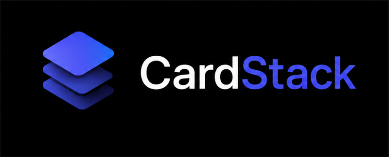

# CardStack

<p align="center">
  
</p>

<p align="center">
  A beautiful, private credit card manager for Android.<br/>
  No ads. No cloud. No bloat.
</p>

<p align="center">
  
  
  
  
</p>

<p align="center">
  
  
  
  
  
</p>

---

## Download

> **[⬇ CardStack.apk](CardStack.apk)** — sideload directly on any Android 10+ device

Enable **Install from unknown sources** when prompted (one-time).

---

## Features

### 🔒 Biometric Lock
- Fingerprint / face unlock on every open
- Auto-lock after a configurable timeout (1 / 2 / 5 / 10 min)
- `FLAG_SECURE` on all windows — no screenshots, no recents preview

### 💳 Card Management
- Add cards with nickname, bank, last 4 digits, network (Visa / MC / Amex / RuPay)
- Credit limit, billing cycle date, payment due date
- Reward currency (points / cashback / miles) and reward rate
- Per-card monthly interest rate for the simulator
- Live gradient card preview while editing, 5 colour themes

### 📅 Due Date Tracking
- Home screen cards sorted by upcoming due date
- Colour-coded due pill: green (>7 days) → amber (3–7) → red (<3)
- Balance tiles: outstanding / minimum due / full due (manually entered)
- Interest simulator — enter your planned payment, see projected interest

### 📊 Spend Visibility
- Manual transaction entry: amount, merchant, category, date, notes
- Categories: Food · Travel · Fuel · Shopping · Entertainment · Utilities · Other
- Search and filter transactions by merchant or category
- Per-card or all-cards transaction list

### 📈 Analytics
- **Donut chart** — spend by category this month
- **Bar chart** — month-on-month total spend (last 6 months)
- **Utilisation bars** — current outstanding vs credit limit, warns visually at 30%
- All charts rendered with custom Canvas — no third-party chart library

### ⭐ Rewards
- Reward balance per card (manually updated)
- Automatic INR conversion using each card's reward rate
- Total reward value across all cards on home screen
- **Best card suggester** — pick a spend category, see cards ranked by reward rate

### 📤 Data Portability
- Export full backup as **JSON** → saved to Downloads
- Export transactions as **CSV** → opens in Excel / Google Sheets
- Import from a previous JSON backup (full restore)

---

## Screenshots

| Lock Screen | Home | Card Detail |
|:-----------:|:----:|:-----------:|
| *(biometric prompt on launch)* | *(cards sorted by due date)* | *(balance + interest sim)* |

| Add Card | Analytics | Rewards |
|:--------:|:---------:|:-------:|
| *(live preview + gradient picker)* | *(donut + bar charts)* | *(best card suggester)* |

---

## Tech Stack

| Layer | Technology |
|---|---|
| Language | Kotlin 2.0 |
| UI | Jetpack Compose + Material 3 |
| Architecture | MVVM + Repository |
| DI | Hilt |
| Database | Room (local, sandboxed) |
| Auth | AndroidX BiometricPrompt |
| Navigation | Navigation Compose |
| Charts | Custom Canvas (no library) |
| Serialisation | Gson |
| Build | Gradle Kotlin DSL + Version Catalog |

---

## Building from Source

### Prerequisites
- JDK 17 ([Temurin](https://adoptium.net/))
- Android SDK — platform `35`, build-tools `34.0.0`  
  *(install via [command-line tools](https://developer.android.com/studio#command-line-tools-only) + `sdkmanager`)*

### Steps

```bash
# 1. Clone
git clone https://github.com/abhijatchaturvedi/CardStack.git
cd CardStack

# 2. Point to your SDK
echo "sdk.dir=C:\\Android" > local.properties   # Windows
# echo "sdk.dir=/opt/android-sdk"  > local.properties  # Linux/Mac

# 3. Build
.\gradlew.bat assembleDebug          # Windows
# ./gradlew assembleDebug            # Linux/Mac

# 4. Install (USB + adb)
adb install app\build\outputs\apk\debug\app-debug.apk
```

---

## Project Structure

```
app/src/main/java/com/cardstack/app/
├── data/
│   ├── db/             # Room entities, DAO, Database, TypeConverters
│   ├── repository/     # CardRepository, SettingsRepository
│   └── ExportImportManager.kt
├── di/                 # Hilt modules (DatabaseModule)
└── ui/
    ├── analytics/      # AnalyticsScreen + ViewModel
    ├── biometric/      # LockScreen, BiometricManager
    ├── card/           # AddEditCard, CardDetail + ViewModels
    ├── common/         # CardVisual, DuePill, DonutChart, BarChart, CategoryUtils
    ├── home/           # HomeScreen + ViewModel
    ├── navigation/     # NavGraph, BottomNav, Screen sealed class
    ├── rewards/        # RewardsScreen + ViewModel
    ├── settings/       # SettingsScreen + ViewModel
    ├── theme/          # Color, Type, Theme (AMOLED dark)
    └── transactions/   # TransactionsScreen, AddTransactionSheet, ViewModel
```

---

## Design

- **True black** (`#000000`) AMOLED background — easy on battery and eyes
- **Accent**: deep indigo / electric blue (`#5C6BC0` family)
- Cards rendered as gradient visuals at the standard 1.586:1 credit-card ratio
- Material 3 dynamic typography throughout
- All data stays on-device — no network calls, no analytics, no tracking

---

## Contributing

Contributions are welcome! This is a personal project, but if you have ideas for improvements or find bugs, feel free to get involved.

### How to contribute

1. **Fork** the repository
2. **Create a branch** for your feature or fix
   ```bash
   git checkout -b feature/your-feature-name
   ```
3. **Make your changes** — keep them focused and minimal
4. **Build and test** on a real device before submitting
   ```bash
   .\gradlew.bat assembleDebug
   adb install -r app\build\outputs\apk\debug\app-debug.apk
   ```
5. **Open a Pull Request** with a clear description of what you changed and why

### Good areas to contribute

- Bug fixes
- UI polish and accessibility improvements
- New card gradient themes
- Additional transaction categories
- Widget for home screen due-date summary
- Database encryption (SQLCipher integration)
- Per-category reward rate overrides per card

### Guidelines

- One feature / fix per PR — keep diffs reviewable
- Follow the existing MVVM pattern: one ViewModel per screen, one Composable per file
- No new third-party dependencies without discussion — the goal is to keep the app lean
- All data must remain local — no network calls, no telemetry

> **Note on licensing:** By submitting a pull request, you agree that your contribution will be licensed under the same [personal use license](#license) as this project. Contributions cannot be used to circumvent the non-commercial restriction.

---

## License

```
CardStack Personal Use License — Copyright (c) 2026 Abhijat Chaturvedi
```

**Free for personal, non-commercial use.** You may use, fork, and modify this software for your own private purposes.

**Commercial use is not permitted.** This includes selling the app, bundling it into a paid product, or using it to provide a paid service to others.

See the full [LICENSE](LICENSE) file for details.  
For commercial licensing enquiries: **abhijatchaturvedi@gmail.com**
